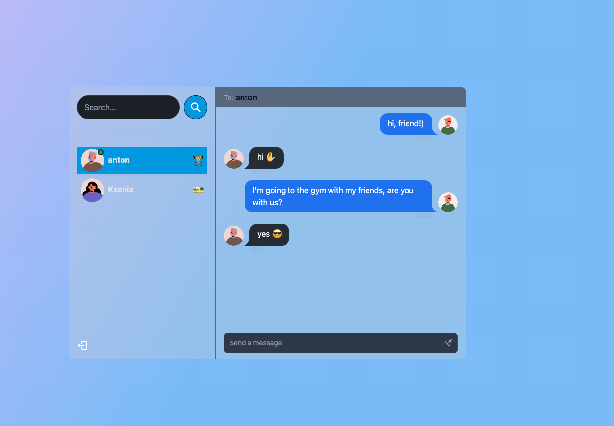

#  Скачайте и разверните приложения для общения в режиме реального времени | JWT, Socket.io

Демонстрационное приложение

<div align="center">
  
</div>

Некоторые возможности:

- 🌟 Технический стек: MERN + Socket.ввод-вывод + TailwindCSS + Daisy UI
- 🎃 Аутентификация и авторизация с помощью JWT
- 👾 Обмен сообщениями в режиме реального времени с помощью Socket.io
- 🚀 Онлайн-статус пользователя (Socket.ввод-вывод и контекст React)
- 👌 Глобальное управление состоянием с помощью Zustand
- 🐞 Обработка ошибок как на сервере, так и на клиенте
- ⭐ В конце бесплатное развертывание как у профессионала!
- ⏳ И многое другое!

### Установочный файл .env

```js
PORT=...
MONGO_DB=...
JWT_SECRET=...
NODE_ENV=...
```

### Создайте приложение

```shell
npm run build
```

### Запустите приложение

```shell
npm start
```
